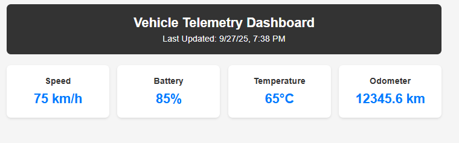
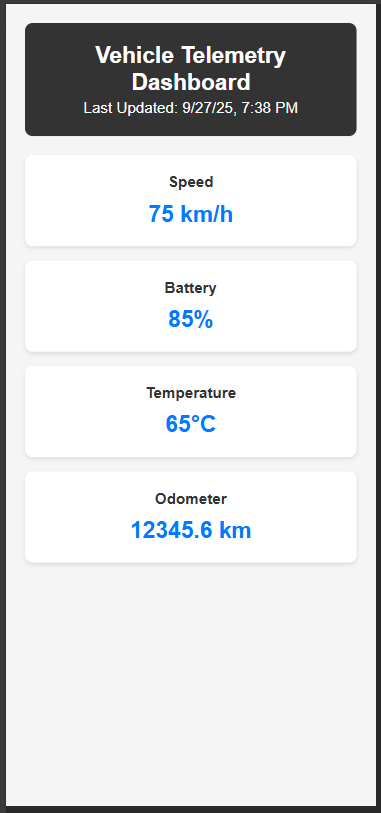

# 🚗 Vehicle Telemetry Overview

##  Overview

Web dashboard for monitoring electric vehicle telemetry data in real-time. Built with Angular standalone components and designed for Industrial IoT (IIoT) applications with minimal complexity and maximum efficiency.

##  System Architecture

```text
┌─────────────────┐    ┌──────────────────┐    ┌─────────────────┐
│   VEHICLE       │    │   DATA LAYER     │    │   PRESENTATION  │
│   SENSORS       │    │                  │    │     LAYER       │
│                 │    │                  │    │                 │
│ • Speed Sensor  │ >> │ • JSON File      │ >> │ • Angular App   │
│ • Battery BMS   │    │ • HTTP Client    │    │ • Dashboard UI  │
│ • Temperature   │    │ • 5sec Intervals │    │ • Metric Cards  │
│ • Odometer      │    │ • Error Handling │    │ • Responsive    │
└─────────────────┘    └──────────────────┘    └─────────────────┘
        │                       │                       │
        ▼                       ▼                       ▼
   Data Sources            Processing Layer         User Interface
```

### Data Flow
1. **Vehicle Sensors** → Generate telemetry data (simulated via JSON)
2. **HTTP Client** → Fetches data every 5 seconds
3. **RxJS Observable** → Streams data to components
4. **Dashboard UI** → Displays real-time metrics

##  Featuresy Dashboard

A **minimal Angular application** for real-time vehicle telemetry monitoring with IIoT capabilities and JSON-based data simulation.


##  Screenshots

### Desktop View


### Mobile View  


##  Overview

Lightweight web dashboard for monitoring electric vehicle telemetry data in real-time. Built with Angular standalone components and designed for Industrial IoT (IIoT) applications with minimal complexity and maximum efficiency.

##  Features

###  **Real-Time Monitoring**
- Live vehicle telemetry updates every 5 seconds
- Four essential metrics: Speed, Battery, Temperature, Odometer
- Clean, responsive card-based layout
- JSON-based data simulation (no backend required)

###  **Technical Features**
- Angular 20+ with standalone components
- RxJS BehaviorSubject for reactive data streams
- HTTP client for JSON data loading
- Minimal bundle size (12.58 kB total)
- Mobile-first responsive design

###  **IIoT Capabilities**
- Edge computing simulation (client-side processing)
- Real-time data visualization
- Scalable architecture for fleet monitoring
- Foundation for predictive maintenance systems

##  Quick Start

```bash
# Clone and install
git clone https://github.com/RitaJind/vehicle-telemetry-dashboard.git
cd vehicle-telemetry-dashboard
npm install

# Start development server
ng serve
# Open http://localhost:4200
```

##  Tech Stack

- **Frontend**: Angular 20+, TypeScript 5+
- **State Management**: RxJS BehaviorSubject
- **HTTP Client**: Angular HttpClient
- **Styling**: CSS3 with Grid layout
- **Data Source**: JSON file (simulates IoT data stream)

##  Project Structure

```text
src/
├── app/
│   ├── dashboard/
│   │   ├── dashboard.html     # Main dashboard UI
│   │   └── dashboard.ts       # Component logic
│   ├── services/
│   │   └── telemetry-simulation.service.ts  # Data service
│   ├── app.html               # Root template
│   └── app.ts                 # Root component
├── assets/
│   └── simple_telemetry.json  # Sample telemetry data
└── styles.css                 # Global styles
```

##  Data Model

### Telemetry Interface
```typescript
interface TelemetryData {
  timestamp: string;           // ISO timestamp
  speed_kph: number;          // Vehicle speed (km/h)
  battery_soc_percent: number; // Battery state of charge (%)
  motor_temp_c: number;       // Motor temperature (°C)
  odometer_km: number;        // Total distance (km)
}
```

##  IIoT Integration

### Current Implementation
- **Data Source**: JSON file simulation
- **Update Frequency**: 5-second intervals
- **Communication**: HTTP GET requests
- **Processing**: Client-side edge computing

### Production Ready Extensions
- MQTT/WebSocket integration for live data streams
- Time-series database connectivity
- Alert thresholds and notifications
- Multi-vehicle fleet management

##  Development Status

### ✅ **Completed**
- Real-time telemetry simulation
- Responsive dashboard interface  
- Minimal bundle optimization
- Basic IIoT architecture demonstration

### 🔄 **Potential Enhancements**
- Chart.js integration for historical trends
- Leaflet maps for GPS tracking
- Alert system for threshold monitoring  
- WebSocket support for live data feeds

## 📈 Performance Metrics

- **Bundle Size**: 12.58 kB (89% reduction from initial)
- **Load Time**: < 3 seconds
- **Update Frequency**: 5-second real-time cycles
- **Mobile Responsive**: 100% compatible

##  Use Cases

### Fleet Management
- Monitor electric vehicle fleets
- Track battery health and performance
- Optimize charging schedules

### Predictive Maintenance  
- Motor temperature monitoring
- Battery degradation tracking
- Preventive maintenance scheduling

### Operational Intelligence
- Real-time KPI dashboards
- Performance analytics
- Cost optimization insights

## Building

```bash
ng build
```

---

## About the Developer

**Rita Jindal** - Software Engieer  

*Passionate about building scalable, secure, and maintainable software solutions. Experienced in microservices architecture, cloud-native, and full-stack software development.*


